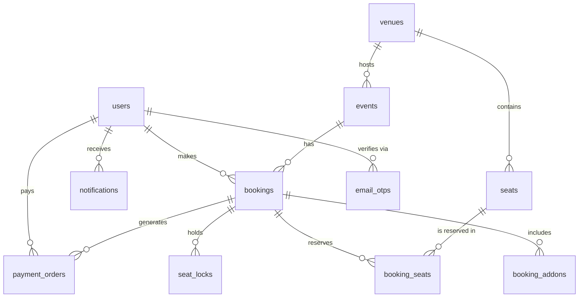

# Database Schema Overview

You have **12 main tables** in your database.

Here is a visual map of how they are connected together. Arrows point from the "child" table to the "parent" table they belong to.

### 1. The Core Infrastructure
- **`venues`** is the very top of the chain.
- An **`event`** belongs to one venue.
- A **`seat`** belongs to one venue.

### 2. The User Flow
- A **`user`** logically connects to their **`bookings`**, their **`notifications`**, and their **`payment_orders`**.
  - *New:* Users now support Google Authentication via the `google_id` column. The `password_hash` column is now nullable to support Google-only accounts.
  - *Note:* The `auth-api` service (which manages `users`, `email_otps`, and `notifications`) now uses TypeORM instead of raw SQL. The single source of truth for the schema remains `schema.sql`.
- *(Fun fact: The connection between `bookings` and `users` is just a soft link rather than a strict database constraint. This is because your Auth service and Booking service are built as independent microservices!)*

### 3. The Booking Web
When a user buys a ticket, it creates a spiderweb of connected records:
- A **`booking`** points to the **`event`** they want to attend.
- The **`booking_seats`** table acts as a bridge connecting the **`booking`** to the specific physical **`seats`** they chose.
- The **`payment_orders`** table points back to the **`booking`** to track the Razorpay transaction.
- The **`seat_locks`** table points to the **`booking`** and the **`seat`** to freeze the seats so nobody else can buy them while the user is entering their credit card info.

### 4. Standalone Tables
- **`email_otps`**: Just temporary codes that are checked against an email address.
- **`short_links`**: completely independent table used for URL shortening, not connected to anything else.
